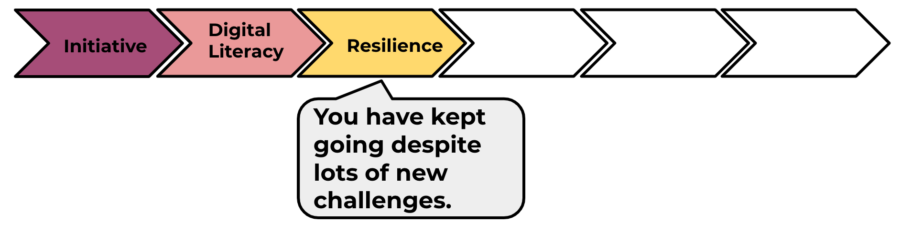

--- challenge ---
## Challenge: Shake your micro:bit
Can you code your micro:bit to make a decision when it is shaken instead of when a button is pressed?

--- /challenge ---

Click on the 'Click me' button to try the next project:

<a href="https://codeclub.org/en/microbit1">

